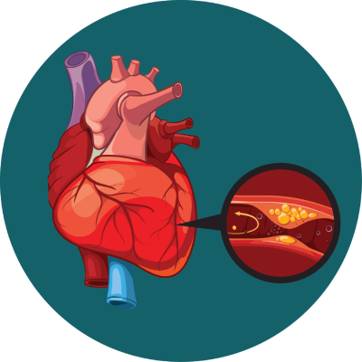

<style>
body {
  font-size: 16px;
}
h4 {
  font-size: 24px;
}
h1, h2, h3 {
  font-size: 28px;
}
</style>


```{r setup, include=FALSE, message=FALSE, warning=FALSE}
knitr::opts_chunk$set(echo = TRUE)
library(flexdashboard)
#Install thematic and un-comment for themed static plots (i.e., ggplot2)
#thematic::thematic_rmd(font = "auto")

# Install necessary packages if they are not already installed.
if (!requireNamespace("RCurl", quietly = TRUE)) {
  install.packages("RCurl")
}
if (!requireNamespace("tidyverse", quietly = TRUE)) {
  install.packages("tidyverse")
}
if (!requireNamespace("patchwork", quietly = TRUE)) {
  install.packages("patchwork")
}
if (!requireNamespace("corrplot", quietly = TRUE)) {
  install.packages("corrplot")
}

# Load the required libraries
library(RCurl)
library(tidyverse)
library(patchwork)
library(corrplot)
library(GGally)
```

Column {data-width=700 .tabset .tabset-fade}
-----------------------------------------------------------------------

### BUSINESS UNDERSTANDING

#### **Background**
Heart disease is a leading global health concern, accounting for a significant number of deaths each year. It encompasses various conditions affecting the heart, including coronary artery disease, heart attacks, and arrhythmias. Early detection and accurate diagnosis are critical in preventing complications, reducing healthcare costs, and improving patient outcomes.

Hospitals, healthcare providers, and insurance companies are increasingly interested in using data-driven insights to support early intervention strategies. Early identification of individuals at risk of developing heart disease not only improves patient outcomes but also plays a vital role in preventive cardiology initiatives.

The Heart Disease dataset from the UCI Machine Learning Repository provides a valuable collection of patient attributes, including demographic information, medical test results, and lifestyle factors. Key indicators such as age, cholesterol levels, blood pressure, and chest pain type are included, offering a rich basis for analysis. Analyzing this data can help uncover patterns and correlations that contribute to heart disease and support better decision-making in medical settings.

Data visualization plays a crucial role in understanding complex medical datasets. By employing exploratory data analysis (EDA) and visualization techniques, we can uncover hidden trends, compare different risk factors, and generate insights that support clinical and operational decisions. This project focuses on utilizing various data visualization methods to analyze the UCI Heart Disease dataset and provide a clearer understanding of the factors influencing heart disease risk.


#### **Business Objectives**
- **Primary Objective**: Gain exploratory insights into key factors associated with heart disease from the UCI dataset through data visualization and analysis.
- **Secondary Objective**: Identify patterns, trends, and relationships within the dataset that can later guide predictive modeling efforts and hypothesis generation.
- **Long-Term Vision**: Equip healthcare professionals, researchers, and organizations with better data insights that can lead to improved decision-making, early intervention strategies, and preventive healthcare initiatives in cardiology.

At this stage, **no predictive model** is being developed. The goal is purely **exploratory**: to generate hypotheses, guide future analytical strategies, and understand the structure and relationships in the data.


### DATA UNDERSTANDING

#### **Data Collection**
The dataset used is the **Heart Disease** dataset from the **UCI Machine Learning Repository**. It is a compilation of four databases (Cleveland, Hungary, Switzerland, and Long Beach VA), but most studies (and this project) focus primarily on the **Cleveland dataset**, which has the most complete records.

The dataset contains various features related to patients' health and demographic information. We will explore the dataset to understand its structure and relationships between variables.

#### **Data Description**
The dataset contains 14 key attributes that are either numerical or categorical. These attributes are:

  1. **age:** Age of the patient (numeric)
  2. **sex:** Gender of the patient (1 = male, 0 = female)
  3. **cp:** Chest pain type (categorical: 1-4)
  4. **trestbps:** Resting blood pressure (numeric)
  5. **chol:** Serum cholesterol (numeric)
  6. **fbs:** Fasting blood sugar (1 = true, 0 = false)
  7. **restecg:** Resting electrocardiographic results (categorical)
  8. **thalach:** Maximum heart rate achieved (numeric)
  9. **exang:** Exercise-induced angina (1 = yes, 0 = no)
  10. **oldpeak:** ST depression induced by exercise (numeric)
  11. **slope:** The slope of the peak exercise ST segment (categorical)
  12. **ca:** Number of major vessels (0-3, numeric)
  13. **thal:** Thalassemia (categorical: 1 = normal, 2 = fixed defect, 3 = reversible defect)
  14. **target:** Heart disease (1 = disease, 0 = no disease)  
  
> **Note:** Some fields (e.g., "ca" and "thal") may contain missing or invalid values coded as '?', which need attention during preprocessing.
  
#### **Data Dictionary**
The dataset contains **303 instances (patients)** and **14 main attributes** plus the target variable (presence or absence of heart disease).
  
|**Attribute**| **Data Type** | **Description** | **Contraints/Rules** |
|:--------------|:---------|:----------------|:---------------------|
| **`age`** | Numerical | The age of the patient in years | Range: 29 - 77 (Based on the dataset statistics) |
| **`sex`** | Categorical | The gender of the patient | Values: 1 = Male, 0 = Female |
| **`cp`** | Categorical | Type of chest pain experienced by the patient | Values: 1 = Typical angina, 2 = Atypical angina, 3 = Non-anginal pain, 4 = Asymptomatic |
| **`trestbps`** | Numerical | Resting blood pressure of the patient, measured in mmHg | Range: Typically, between 94 and 200 mmHg |
| **`chol`** | Numerical | Serum cholesterol level in mg/dl | Range: Typically, between 126 and 564 mg/dl |
| **`fbs`** | Categorical | Fasting blood sugar level > 120 mg/dl | Values: 1 = True, 0 = False |
| **`restecg`** | Categorical | Results of the patient’s resting electrocardiogram | Values: 0 = Normal, 1 = ST-T wave abnormality, 2 = Probable or definite left ventricular hypertrophy |
| **`thalach`** | Numerical | Maximum heart rate achieved during a stress test | Range: Typically, between 71 and 202 bpm |
| **`exang`** | Categorical | Whether the patient experiences exercise-induced angina | Values: 1 = Yes, 0 = No |
| **`oldpeak`** | Numerical | ST depression induced by exercise relative to rest (an ECG measure) | Range: 0.0 to 6.2 (higher values indicate more severe abnormalities) |
| **`slope`** | Categorical | Slope of the peak exercise ST segment | Values: 1 = Upsloping, 2 = Flat, 3 = Downsloping |
| **`ca`** | Numerical | Number of major vessels colored by fluoroscopy | Range: 0-3 |
| **`thal`** | Categorical | Blood disorder variable related to thalassemia | Values: 3 = Normal, 6 = Fixed defect, 7 = Reversible defect |
| **`target`** | Categorical | Diagnosis of heart disease | Values: 0 = No heart disease, 1 = Presence of heart disease |

#### **Initial Data Quality Assessment**
- **Missing Values**: Some fields like `ca` and `thal` may have missing values or unknown entries ('?').
- **Data Types**: Some categorical variables are encoded numerically and will need to be interpreted correctly during analysis.
- **Class Imbalance**: Preliminary checks suggest the dataset is relatively balanced between presence and absence of disease, but this will be verified.
- **Outliers**: Numerical fields such as `chol` (cholesterol) and `trestbps` (blood pressure) may have outliers that need to be detected and considered in analysis.


### DATA PREPARATION

#### **Data Loading**
Load the dataset from UCI website using RCurl library
```{r}
# Create url object to retrieve the dataset from UCI Machine Learning Repository
url <- "https://archive.ics.uci.edu/ml/machine-learning-databases/heart-disease/processed.cleveland.data"

# Read the dataset into a dataframe
Heart.df <- read.csv(url(url), header = FALSE, na.strings = "?")
```

Display dimensions of the dataframe
```{r}
dim(Heart.df)
```

View the first six rows of the dataset
```{r}
head(Heart.df)
```


#### **Data Preprocessing**
Renaming the column names for clarity
```{r}
colnames(Heart.df) <- c("age", "sex", "cp", "trestbps", "chol", "fbs", "restecg", "thalach", "exang", "oldpeak", "slope", "ca", "thal", "target")
```

Display the structure of the dataframe
```{r}
str(Heart.df)
```

Display the statistical summary of the dataframe
```{r}
summary(Heart.df)
```

According to the Data Dictionary, the following attributes should be have binary variables, `sex`, `fbs`, `exang`, and `target`. But, some shows to have values besides 0's and 1's.  
Let's convert binary variables to (0, 1)
```{r}
Heart.df$sex <- ifelse(Heart.df$sex > 0, 1, 0)
Heart.df$fbs <- ifelse(Heart.df$fbs > 0, 1, 0)
Heart.df$exang <- ifelse(Heart.df$exang > 0, 1, 0)
Heart.df$target <- ifelse(Heart.df$target > 0, 1, 0)
```

Check to see if there are missing values in the dataframe
```{r}
sapply(Heart.df, function(x) sum(is.na(x)))
```

From the summary and the table above, there are some missing values in `ca` and `thal` columns.  
Let's handle the missing values using mean/mode imputation method
```{r}
# If missing values exist in 'ca' or 'thal', handle them using mean/mode imputation
Heart.df$ca[is.na(Heart.df$ca)] <- median(Heart.df$ca, na.rm = TRUE)
Heart.df$ca[Heart.df$ca == "?"] <- median(Heart.df$ca, na.rm = TRUE)
Heart.df$thal[is.na(Heart.df$thal)] <- median(Heart.df$thal, na.rm = TRUE)
Heart.df$thal[Heart.df$thal == "?"] <- median(Heart.df$ca, na.rm = TRUE)
```

Check for duplicate entries in the dataframe and print them out
```{r}
dupes <- Heart.df[duplicated(Heart.df) | duplicated(Heart.df, fromLast = TRUE), ]
# Print or inspect the duplicate entries
print(dupes)
```

Convert categorical attributes to factors
```{r factorization}
# Define a list of categorical columns with their levels and labels
categorical_columns <- list(
  sex = list(levels = c(0, 1), labels = c("Female", "Male")),
  cp = list(levels = c(1, 2, 3, 4), labels = c("Typical Angina", "Atypical Angina", "Non-Angina", "Asymptomatic")),
  fbs = list(levels = c(0, 1), labels = c("False", "True")),
  restecg = list(levels = c(0, 1, 2), labels = c("Normal", "Wave-abnormality", "Probable")),
  exang = list(levels = c(0, 1), labels = c("No", "Yes")),
  slope = list(levels = c(1, 2, 3), labels = c("Upsloping", "Flat", "Downsloping")),
  thal = list(levels = c(3, 6, 7), labels = c("Normal", "Fixed Defect", "Reversible")),
  target = list(levels = c(1, 0), labels = c("Yes", "No"))
)

# Apply the factor transformation using a loop
for (col in names(categorical_columns)) {
  Heart.df[[col]] <- factor(Heart.df[[col]], 
                            levels = categorical_columns[[col]]$levels, 
                            labels = categorical_columns[[col]]$labels)
}
```

#### **Handle Outliers**
Apply multiple filtering conditions to remove outliers
```{r}
Heart.df <- Heart.df[Heart.df$age > 40 &
                       Heart.df$trestbps < 170 & 
                       Heart.df$chol < 340 & 
                       Heart.df$chol > 150 &
                       Heart.df$thalach > 115 &
                       Heart.df$oldpeak < 2.4, ]
```


####

<br>


### VISUALIZATION

#### **Custom Functions**
Function to create Box plots
```{r boxplot_function}
HeartDiseaseBoxplot <- function(var1, var2) {
  ggplot(Heart.df, aes(x = .data[[var1]],
                       y = .data[[var2]],
                       fill = .data[[var1]])) +
    geom_boxplot() + theme_test() +
    labs(title = paste("Boxplot of", var2, "by", var1),
         x = var1, y = var2, fill = "Heart Disease")
}
```

Function to create Bar plots
```{r bar_function}
HeartDiseaseBar <- function(var) {
  ggplot(Heart.df, aes(x = .data[[var]], fill = target)) +
    geom_bar(position = "dodge") + theme_test() +
    labs(title = paste("Distribution of Heart Disease by", var),
         x = var, fill = "Heart Disease")
}
```

Function to create Histograms
```{r histogram_function}
HeartDiseaseHist <- function(var1) {
  ggplot(Heart.df, aes(x = .data[[var1]], fill = target)) +
    geom_histogram(bins = 15) + theme_test() +
    labs(title = paste("Distribution of", var1),
         x = var1, fill = "Heart Disease")
}
```

Function to create Scatter plots
```{r scatterfunction}
HeartDiseaseScatter <- function(point1, point2){
  ggplot(Heart.df, aes(x = .data[[point1]],
                       y = .data[[point2]],
                       color = target)) +
    geom_point(size = 2) + theme_test() +
    geom_smooth(method = "lm", se = FALSE, color = "blue", formula = y ~ x) +
    labs(title = paste("Scatterplot of", point1, "by", point2),
       x = point1, y = point2, color = "Heart Disease")
}
```

#### **Boxplots**
Create boxplots of continuous variables.  
```{r, fig.width = 10, fig.height = 10}
# Create the plots
p1 <- HeartDiseaseBoxplot("target", "age")
p2 <- HeartDiseaseBoxplot("target", "trestbps")
p3 <- HeartDiseaseBoxplot("target", "chol")
p4 <- HeartDiseaseBoxplot("target", "thalach")
p5 <- HeartDiseaseBoxplot("target", "oldpeak")

# Combine plot using patchwork
(p1 | p2) /
(p3 | p4) /
(p5)
```

##### **Box Plots Interpretation and Analysis**


<br>

#### **Barplots**
Create the distribution of heart disease by categorical variables
```{r, fig.width = 10, fig.height = 14}
# Create the plots
g1 <- ggplot(Heart.df, aes(x=target, fill=target))+
  geom_bar() + theme_test() +
  ggtitle("Distribution of Heart Disease") +
  labs(x = "Heart Disease", fill = "Heart Disease")
g2 <- HeartDiseaseBar("sex")
g3 <- HeartDiseaseBar("cp")
g4 <- HeartDiseaseBar("fbs")
g5 <- HeartDiseaseBar("restecg")
g6 <- HeartDiseaseBar("exang")
g7 <- HeartDiseaseBar("slope")
g8 <- HeartDiseaseBar("thal")

# Combine plot using patchwork
(g1 | g2) /
(g3 | g4) /
(g5 | g6) /
(g7 | g8)
```

##### **Bar Plots Interpretation and Analysis**


<br>

#### **Histogram Distributions**
Create histogram distributions of continuous variables.  
```{r, fig.width = 10, fig.height = 10}
# Create the plots
p1 <- HeartDiseaseHist("age")
p2 <- HeartDiseaseHist("trestbps")
p3 <- HeartDiseaseHist("chol")
p4 <- HeartDiseaseHist("thalach")
p5 <- HeartDiseaseHist("oldpeak")

# Combine plot using patchwork
(p1) /
(p2 | p3) /
(p4 | p5)
```

##### **Histogram Plots Interpretation and Analysis**


<br>

#### **Scaterplots**
Create scatterplots of continuous variables. 
```{r scatterplot, fig.width = 10, fig.height = 14}
# Create the plots
p1 <- HeartDiseaseScatter("age", "oldpeak")
p2 <- HeartDiseaseScatter("age", "chol")
p3 <- HeartDiseaseScatter("age", "trestbps")
p4 <- HeartDiseaseScatter("age", "thalach")
p5 <- HeartDiseaseScatter("chol", "thalach")
p6 <- HeartDiseaseScatter("trestbps", "chol")
p7 <- HeartDiseaseScatter("thalach", "oldpeak")

# Combine plot using patchwork
(p1 | p2) /
(p3 | p4) /
(p5 | p6) /
(p7)
```

##### **Scatter Plots Interpretation and Analysis**


<br>

#### **Pair Plots**
Pairwise relationship between multiple continuous variables
```{r pair_plots, fig.width = 10, fig.height = 5}
# Create a colored pair plot for selected variables
ggpairs(Heart.df[, c("age", "trestbps", "chol", 
                     "thalach", "oldpeak", "target")], 
        aes(color = target, fill = target))
```

##### **Pair Plots Interpretation and Analysis**
The distribution of **Age** between patients with and without heart disease overlaps considerably. However, individuals without heart disease ("No") tend to have a slightly younger age distribution. The boxplot comparison highlights this difference, though it is not particularly dramatic.

Looking at **Trestbps** (resting blood pressure), there is a modest positive correlation with age overall (0.273). Interestingly, patients without heart disease show a slightly stronger correlation (0.297) compared to those diagnosed with heart disease (0.206).

When examining **Chol** (cholesterol levels), correlations with other variables are very weak in both the "Yes" and "No" groups. Cholesterol does not appear to be a strong factor for separating patients with heart disease from those without, based on the current plots.

In contrast, **Thalach** (maximum heart rate achieved) shows a strong negative correlation with age, particularly among patients without heart disease (No: -0.444***). This suggests that patients without heart disease are able to achieve higher maximum heart rates compared to those with heart disease.

**Oldpeak** (measuring ST depression induced by exercise) exhibits a moderate positive correlation with age, especially for patients without heart disease (No: 0.191). Higher Oldpeak values are more commonly associated with the presence of heart disease.

Focusing on the **Target** variable (indicating heart disease "Yes" or "No"), Oldpeak and Thalach demonstrate the clearest separation between groups. Patients with heart disease typically exhibit higher Oldpeak values and lower Thalach values.

Among all variables, the strongest correlations observed are the negative relationships between **thalach** and **age**, and between **oldpeak** and **thalach**. Despite these findings, most variables individually do not display extremely strong correlations.

In summary, **older patients** tend to have **lower maximum heart rates**, and **higher Oldpeak values** are linked to a **greater risk of heart disease**. Meanwhile, **cholesterol and resting blood pressure** do not visually differentiate heart disease patients from healthy individuals in this analysis.

<br>

#### **Correlation Matrix**
Correlation matrix for continuous variables
```{r correlation_matrix}
# Selecting only continuous variables
continuous_vars <- c("age", "trestbps", "chol", "thalach", "oldpeak")
continuous_data <- Heart.df %>% select(all_of(continuous_vars))

# Calculating correlation matrix
correlation_matrix <- cor(continuous_data)

# Plotting the correlation matrix
corrplot(correlation_matrix, method = "circle",
         type = "lower", tl.col = "black")
```

<br>


Column {data-width=250 .tabset .tabset-fade}
-----------------------------------------------------------------------

### PROBLEM STATEMENT

For exploratory purposes, the project aims to investigate and uncover patterns in patient demographics, clinical features, and diagnostic results that correlate with the presence or absence of heart disease. Specifically, the project will:

- Explore which features (e.g., age, cholesterol level, chest pain type) show strong associations with heart disease.
- Understand how different groups (e.g., by gender or age range) differ in their likelihood of heart disease.
- Identify possible interaction effects between variables that influence the risk of heart disease.
- Use data visualization tools (e.g., correlation matrices, bar plots, boxplots) to make findings interpretable and actionable for non-technical stakeholders.

####

```{r echo=FALSE, out.width = "60%", fig.align = "center"}

```


### CONCLUSION

```{r}

```

